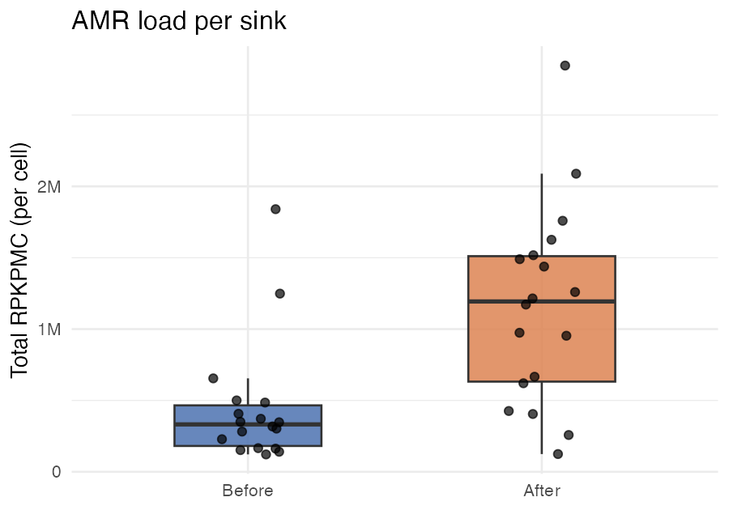
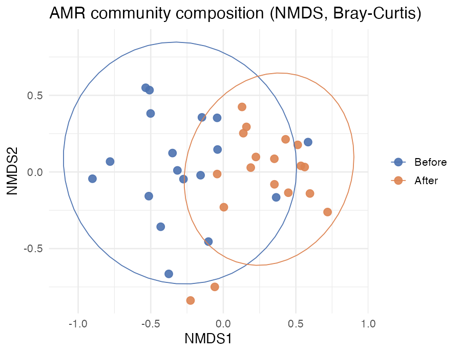
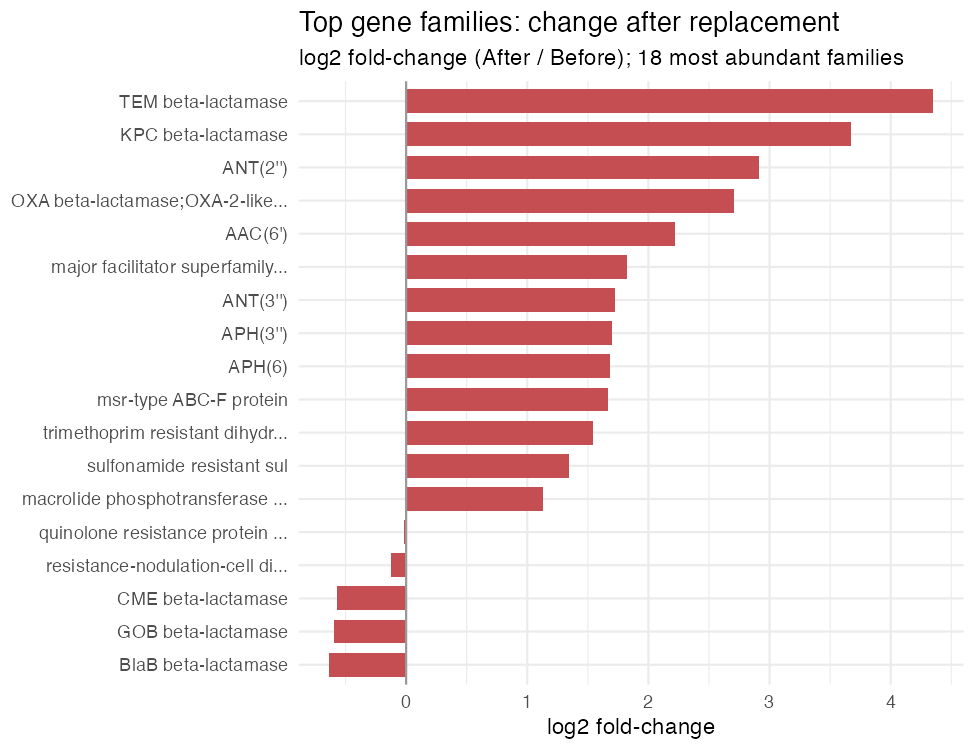
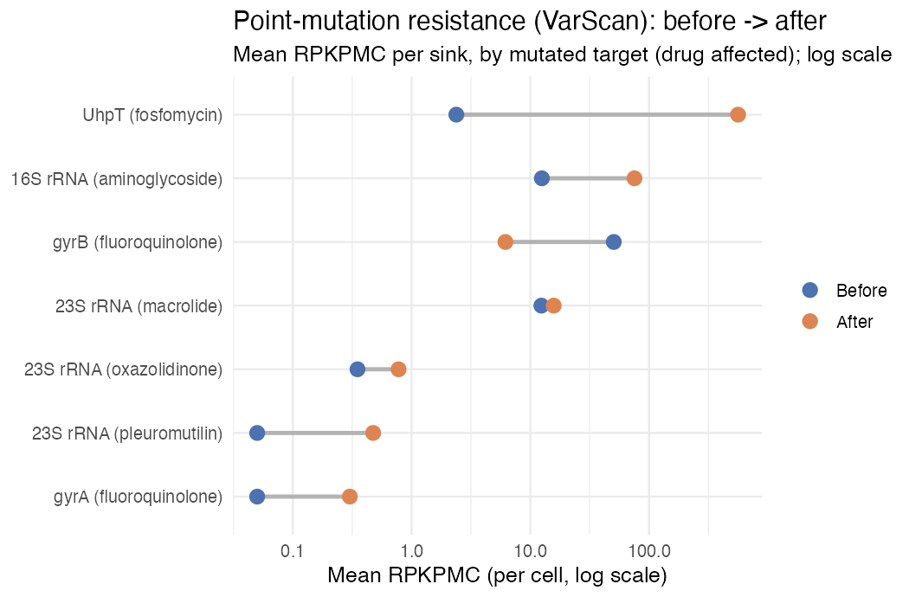

You've run the machinery. Now for the point of it all: **what do the numbers say?**

::: {.callout-note}
## We switch datasets here — on purpose
The 10,000-read subset was perfect for *learning the commands*, but far too shallow to
say anything biological. So this page runs on the **full-depth** reports that ship in
`data/reports_full/` — the real published run, all 36 sinks. Everything below is plain
R you can paste into a session started at the repo root.
:::

The story of these sinks, in four questions:

1. **How much** resistance is there — and did it change?
2. **What kind** — did the *composition* of the resistome shift?
3. **Which genes** drove the change?
4. **What point mutations** came along too — the resistance a gene catalogue can't see?

## Setup

```r
library(readr); library(dplyr); library(tidyr)
library(ggplot2); library(forcats); library(stringr); library(vegan)

INT <- c(Before = "#4C72B0", After = "#DD8452")   # a consistent palette

meta <- read_csv("data/reports_full/metadata.csv", show_col_types = FALSE) |>
  rename(sample = 1) |>
  mutate(intervention = factor(if_else(Intervention == "Old", "Before", "After"),
                               levels = c("Before", "After")))

amr <- read_tsv("data/reports_full/SR_homscan_RPKPMC.tsv", show_col_types = FALSE)
```

`amr` is a wide table: one row per AMR gene, five annotation columns
(`AMR_Gene_Family`, `ARO`, `ARO_Name`, `Drug_Class`, `Resistance_Mechanism`), then
one column of **RPKPMC** per sample. Let's melt it long and attach the metadata:

```r
anno <- c("AMR_Gene_Family","ARO","ARO_Name","Drug_Class","Resistance_Mechanism")
long <- amr |>
  pivot_longer(-all_of(anno), names_to = "sample", values_to = "rpkpmc") |>
  left_join(meta, by = "sample")
```

::: {.callout-important}
## RPKPMC — resistance per bacterial cell
**RPKPMC** is ResScan's preferred default metric: resistance-gene copies **per
bacterial cell**, calibrated against universal single-copy genes rather than against
total reads. Because the denominator is *bacterial* cells, it stays comparable across
samples of different depth and composition — which is also why the
[host-removal step](vanish.qmd) pays off: stray human reads match neither the AMR
genes nor the bacterial markers, so they can't silently inflate or deflate the numbers
the way they would with a total-reads metric like RPKM. ResScan reports a whole family
of metrics alongside it (see the [output reference](output-reference.qmd)); RPKPMC is
simply the one to reach for by default.
:::

## 1 · How much? AMR load per sink

Sum RPKPMC across all genes in a sample and you get its **total resistance load** —
copies of resistance per cell, summed over every gene detected.

```r
per_sample <- long |>
  group_by(sample, intervention) |>
  summarise(total_load = sum(rpkpmc), n_genes = sum(rpkpmc > 0), .groups = "drop")

ggplot(per_sample, aes(intervention, total_load, fill = intervention)) +
  geom_boxplot(width = .5, alpha = .85, outlier.shape = NA) +
  geom_jitter(width = .12, size = 2, alpha = .7) +
  scale_fill_manual(values = INT) +
  scale_y_continuous(labels = scales::label_number(scale_cut = scales::cut_short_scale())) +
  labs(title = "AMR load per sink", x = NULL, y = "Total RPKPMC (per cell)") +
  theme_minimal(base_size = 13) + theme(legend.position = "none")
```

{fig-alt="Boxplot of total RPKPMC per sink, higher after replacement"}

The median load **more than tripled** — roughly **332,000 → 1.19 million** RPKPMC per
sink. Replacing the plumbing didn't reset the resistome; the new drains came back
carrying *more* resistance per cell than the ones they replaced. (This is the
headline of Kotay et al. 2025, reproduced from raw reads with your own hands.)

## 2 · What kind? Composition shift

More resistance is one thing; *different* resistance is another. To ask whether the
whole community's makeup shifted, we put every sample in "resistome space" (each gene
a dimension), measure how dissimilar samples are (**Bray–Curtis**), and squash that
down to two dimensions with **NMDS**.

```r
comm <- t(as.matrix(amr[, meta$sample]))     # samples x genes
set.seed(1)
nmds <- metaMDS(comm, distance = "bray", trace = FALSE)

sc <- as.data.frame(vegan::scores(nmds, "sites")) |>
  tibble::rownames_to_column("sample") |>
  left_join(meta, "sample")

ggplot(sc, aes(NMDS1, NMDS2, colour = intervention)) +
  geom_point(size = 3, alpha = .9) +
  stat_ellipse(aes(group = intervention), linewidth = .4) +
  scale_colour_manual(values = INT) +
  labs(title = "AMR community composition (NMDS, Bray-Curtis)", colour = NULL) +
  theme_minimal(base_size = 13)
```

{fig-alt="NMDS ordination showing before and after clouds overlapping but separated"}

The two clouds **overlap but pull apart** — Before sinks sit left, After sinks shift
right. So it isn't only *more* resistance; the *kind* of resistance moved too. The
overlap is the honest part of the picture: this is a shift in a noisy biological
system, not a clean switch.

## 3 · Which genes drove it?

Finally, name names. Roll RPKPMC up to **gene family**, average within each group, and
rank families by how much they changed (log2 fold-change, After / Before).

```r
fam <- long |>
  group_by(AMR_Gene_Family, sample, intervention) |>
  summarise(load = sum(rpkpmc), .groups = "drop") |>      # per-sample family total
  group_by(AMR_Gene_Family, intervention) |>
  summarise(mean_load = mean(load), .groups = "drop") |>   # then mean across sinks
  pivot_wider(names_from = intervention, values_from = mean_load) |>
  mutate(log2fc = log2((After + 1) / (Before + 1)),
         family = stringr::str_trunc(AMR_Gene_Family, 32)) |>
  slice_max(After + Before, n = 18)                        # 18 most abundant families

ggplot(fam, aes(log2fc, fct_reorder(family, log2fc))) +
  geom_col(fill = "#C44E52", width = .72) +
  geom_vline(xintercept = 0, colour = "grey60") +
  labs(title = "Top gene families: change after replacement",
       subtitle = "log2 fold-change (After / Before); 18 most abundant families",
       x = "log2 fold-change", y = NULL) +
  theme_minimal(base_size = 11)
```

{fig-alt="Horizontal bar chart of log2 fold-change per gene family, TEM and KPC highest"}

::: {.callout-warning}
## Mind the aggregation
We sum genes **within each sample first**, *then* average across sinks — not one big
`mean()` over every gene×sample cell. Average first and a family with many
low-abundance genes gets washed out; the order of operations is the difference between
seeing KPC at the top and missing it entirely.
:::

Almost every abundant family rose, but two β-lactamases lead the board: **TEM**
(log2fc ≈ 4.35) and **KPC** (≈ 3.67) — the carbapenem-resistance family behind
much of the concern about hospital *Klebsiella*. Aminoglycoside families
(`ANT`, `AAC`, `APH`) and efflux/MFS systems climbed too. A handful of environmental
β-lactamases (`BlaB`, `GOB`, `CME`) went the other way — the incumbent drain community
being replaced by a new one.

## 4 · The resistance a gene catalogue can't see (VarScan)

Everything above counted *acquired genes* — resistance you can spot because a whole
gene is **present**. But some of the most clinically important resistance isn't a gene
you gain; it's a **single base that changes** in a gene you already have: one point
mutation in `gyrA` and *E. coli* shrugs off fluoroquinolones; one in 16S rRNA and
aminoglycosides stop working.

Tools that only catalogue genes are blind to this — the mutated gene looks identical to
the normal one at the family level. **ResScan's VarScan module is built for exactly this
job**, and it's a big part of what sets ResScan apart from other comprehensive AMR
pipelines. It ships in the same run, in `SR_varscan_*.tsv`, on the same RPKPMC scale —
so we can ask the same before/after question of point-mutation resistance.

```r
var <- read_tsv("data/reports_full/SR_varscan_RPKPMC.tsv", show_col_types = FALSE)

vlong <- var |>
  pivot_longer(-all_of(anno), names_to = "sample", values_to = "rpkpmc") |>
  left_join(meta, by = "sample")

# burden: total point-mutation resistance, and how many distinct variants, per sink
vlong |>
  group_by(sample, intervention) |>
  summarise(total = sum(rpkpmc), n_var = sum(rpkpmc > 0), .groups = "drop") |>
  group_by(intervention) |>
  summarise(median_load = median(total), mean_variants = mean(n_var))
```

The point-mutation burden **rose about four-fold** (median ≈ 26 → 104 RPKPMC), and the
number of distinct resistance variants per sink went from **~1 to ~3**. Now group by the
mutated target and drug, and draw each target's Before→After move on a log scale:

```r
fam <- vlong |>
  mutate(lab = case_when(
    str_detect(AMR_Gene_Family, "16S|16s")                                            ~ "16S rRNA (aminoglycoside)",
    str_detect(AMR_Gene_Family, "23S") & str_detect(AMR_Gene_Family, "macrolide")     ~ "23S rRNA (macrolide)",
    str_detect(AMR_Gene_Family, "23S") & str_detect(AMR_Gene_Family, "oxazolidinone") ~ "23S rRNA (oxazolidinone)",
    str_detect(AMR_Gene_Family, "23S") & str_detect(AMR_Gene_Family, "pleuromutilin") ~ "23S rRNA (pleuromutilin)",
    str_detect(AMR_Gene_Family, "gyrA")  ~ "gyrA (fluoroquinolone)",
    str_detect(AMR_Gene_Family, "gyrB")  ~ "gyrB (fluoroquinolone)",
    str_detect(AMR_Gene_Family, "UhpT")  ~ "UhpT (fosfomycin)",
    TRUE ~ stringr::str_trunc(AMR_Gene_Family, 30))) |>
  group_by(lab, sample, intervention) |>
  summarise(load = sum(rpkpmc), .groups = "drop") |>
  group_by(lab, intervention) |>
  summarise(mean_load = mean(load), .groups = "drop") |>
  pivot_wider(names_from = intervention, values_from = mean_load) |>
  arrange(After + Before) |>
  mutate(lab = factor(lab, levels = lab),
         Before = pmax(Before, 0.05), After = pmax(After, 0.05))  # floor so 0s plot on log

ggplot(fam, aes(y = lab)) +
  geom_segment(aes(x = Before, xend = After, yend = lab), colour = "grey70", linewidth = 1.1) +
  geom_point(aes(x = Before, colour = "Before"), size = 3.4) +
  geom_point(aes(x = After,  colour = "After"),  size = 3.4) +
  scale_colour_manual(values = INT, breaks = c("Before", "After")) +
  scale_x_log10() +
  labs(title = "Point-mutation resistance (VarScan): before -> after",
       subtitle = "Mean RPKPMC per sink, by mutated target (drug affected); log scale",
       x = "Mean RPKPMC (per cell, log scale)", y = NULL, colour = NULL) +
  theme_minimal(base_size = 12)
```

{fig-alt="Dumbbell plot of point-mutation resistance per target, before and after, on a log scale"}

Read left-to-right, and the clinical picture is pointed. **Fosfomycin**-resistant
`UhpT` mutations went from a whisper to the loudest signal in the panel (≈2 → 563).
**Aminoglycoside**-conferring 16S rRNA mutations climbed six-fold, and
**fluoroquinolone**-resistant `gyrA` — absent before — showed up after. The lone
retreat was `gyrB` (the other fluoroquinolone target). (Points sitting at the far-left
floor were *not detected* before the swap.)

None of this is in the gene-catalogue tables — it's resistance encoded one base at a
time, in drugs (fluoroquinolones, aminoglycosides, fosfomycin) that matter at the
bedside. Miss VarScan and you'd have declared these sinks clean of it.

## The take-home

Four views, one conclusion: after the drains were replaced, the sink resistome came
back **larger** (load tripled), **different** (composition shifted), **clinically
pointier** in its acquired genes (KPC/TEM β-lactamases led the rise), *and* carrying
**more point-mutation resistance** to fluoroquinolones, aminoglycosides, and
fosfomycin (VarScan) — the last of which a gene-catalogue tool would never have seen.
New plumbing, same problem — arguably worse.

::: {.callout-note appearance="simple"}
### Go deeper
This is the teaching cut — four questions, four figures. The full study analysis
carries the rest: per-variant VarScan detail, drug-class and resistance-mechanism
breakdowns, per-room and per-period trends, and formal tests (PERMANOVA on the
Bray–Curtis distances). The same tables in `data/reports_full/` support all of it —
the tools you've now run are all you need to get there.
:::

Want to run this on your own samples? The [**Appendix**](appendix.qmd) covers the real
human index, bring-your-own-reads, and cleanup.
